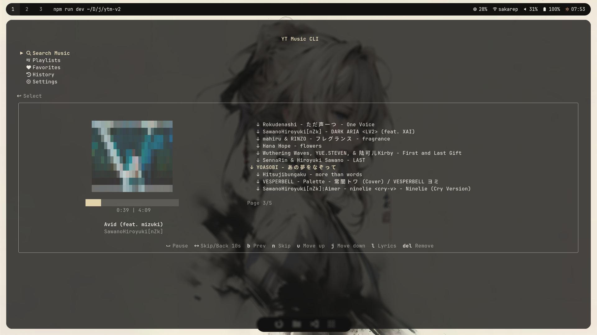
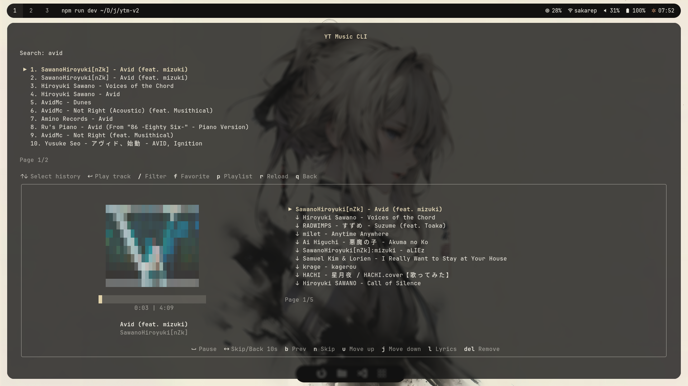
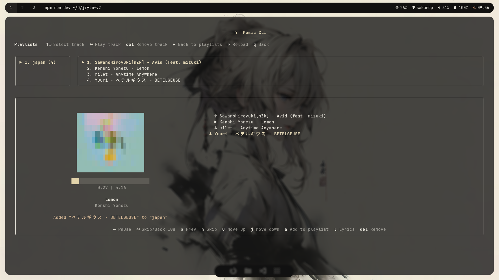
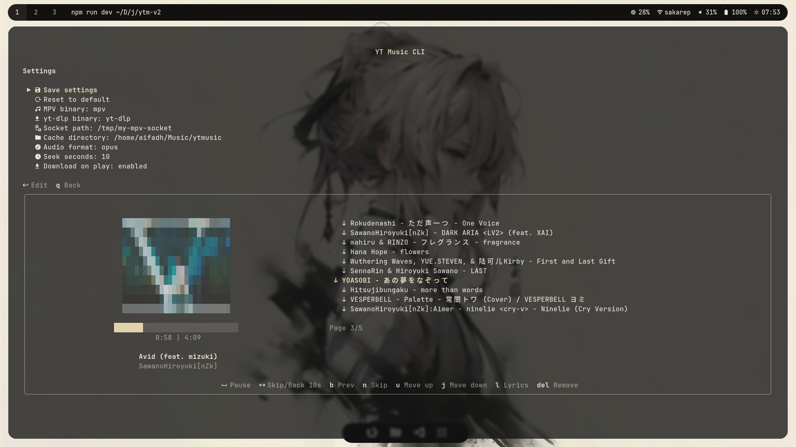

# YT Music CLI

Terminal-based YouTube Music player built with Ink, mpv, yt-dlp, SQLite, and Drizzle ORM.

## Features

- Search and play YouTube Music tracks
- Queue with next, previous, remove, and reorder support
- History, favorites, and playlists
- Lyrics support
- ASCII album cover preview
- Local audio cache
- Configurable settings
- mpv IPC control

## Screenshots

### Home



### Search



### Playlists



### Settings



## Requirements

Install required system packages:
if youre using arch

```bash
sudo pacman -S mpv yt-dlp
```

## Installation

Install from npm:

```bash
npm install -g @afadhili/ytmusic-cli
```

Run:

```bash
ytmusic-cli
```

## Development

Clone the repository:

```bash
git clone https://github.com/afadhili/ytmusic-cli.git
cd ytmusic-cli
```

Install dependencies:

```bash
npm install
```

Run in development mode:

```bash
npm run dev
```

Build:

```bash
npm run build
```

Run built version:

```bash
npm start
```

Link globally for local testing:

```bash
npm link
ytmusic-cli
```

## Notes

This app uses `mpv` for playback and `yt-dlp` for downloading/caching tracks.

Do not expose local API or IPC sockets to the public internet.
